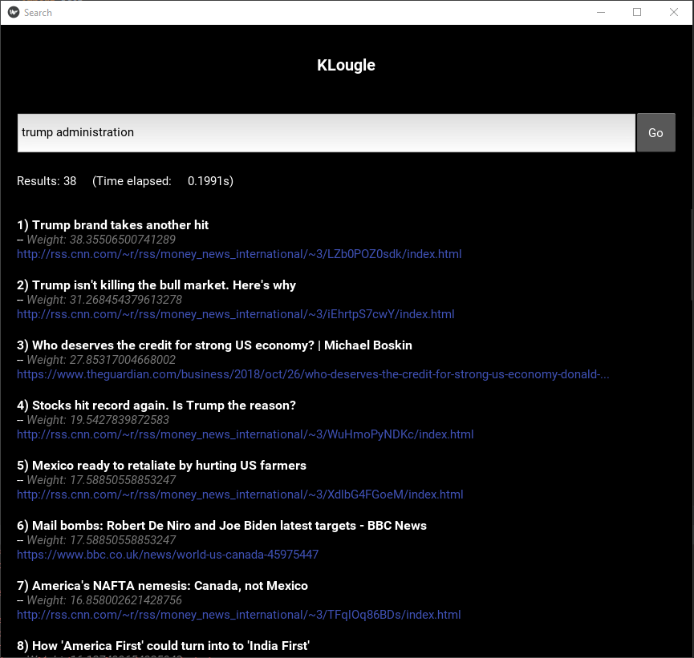

# KLougle

KLougle (any similarity is totally incidental) is an indexing search engine that scrapes data from news sites like [CNN](https://edition.cnn.com/), [BBC](https://www.bbc.com/news) and [The Guardian](https://www.theguardian.com/us) and allows you to perform search queries on the data that it gathers. It was developed as a part of the semester project in my Natural Language Processing class. It is comprised of 2 parts:

## Frontend 

The frontend (```/frontend/main.py```) loads the inverted index, that is located inside the ``` inv_index ``` folder and is able to answer queries provided by the user by returning the links that are most relevant to the question in a descending order (based on the TF-IDF metric).

The [Kivy](https://kivy.org/#home) library is used for the UI.



## Backend 

The backend (```/crawlers/tools/main.py```) is responsible of building the aforementioned inverted index.

First of all it spawns the spiders that will scrape the sites (using ```Beautiful Soup```), based on the restrictions the user has set (which categories, how many links per category).

Then the indexer is spawned which will process the content of the links that were downloaded previously (using [NLTK](https://www.nltk.org/)). It will lemmatize the terms, remove the ones from the closed class categories (articles, modals etc.), and will update the index using the new TF-IDF value of every term.


## Installation & Usage

It has been tested on a Windows 10 environment with Python 3.6 installed using PyCharm IDE. The package requirements to run this, are listed in the ```requirements.txt``` file.

To run any of the above parts, just execute the corresponding ```main.py``` and the console will guide you through the process.


## License
[MIT](https://choosealicense.com/licenses/mit/)
